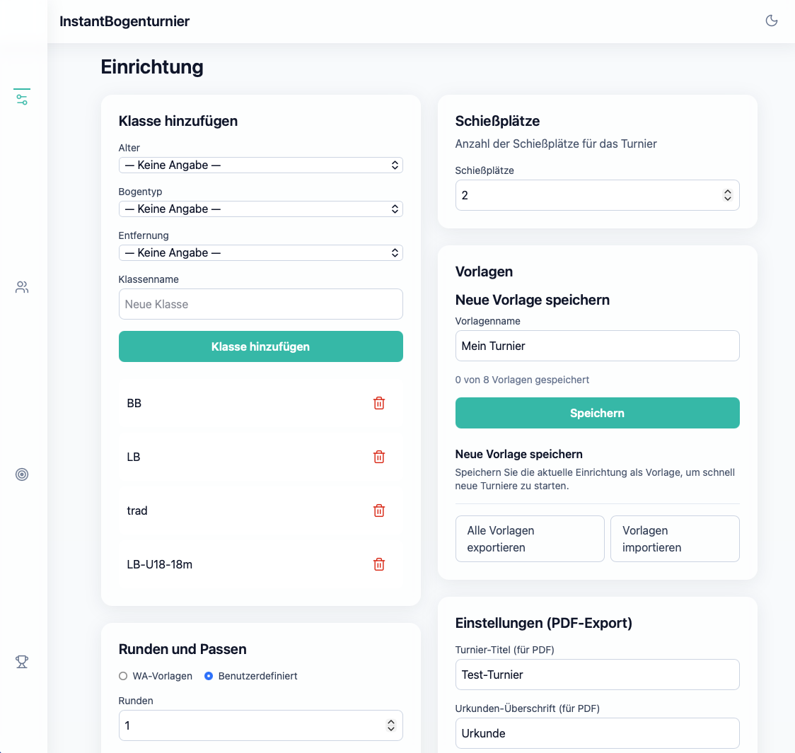
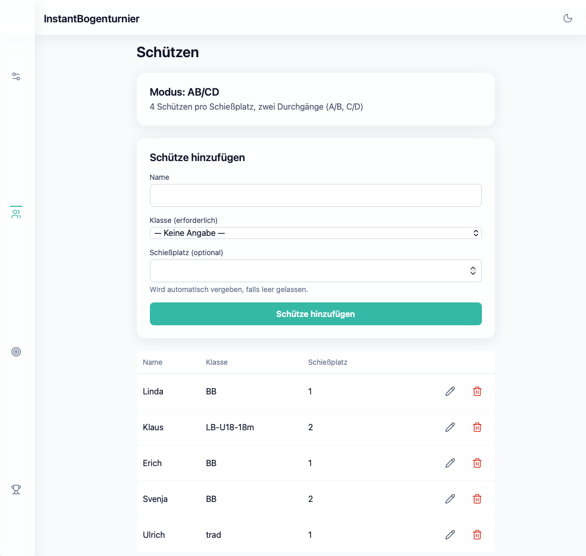
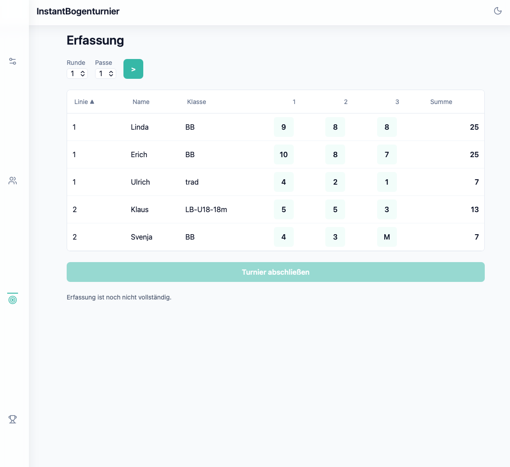
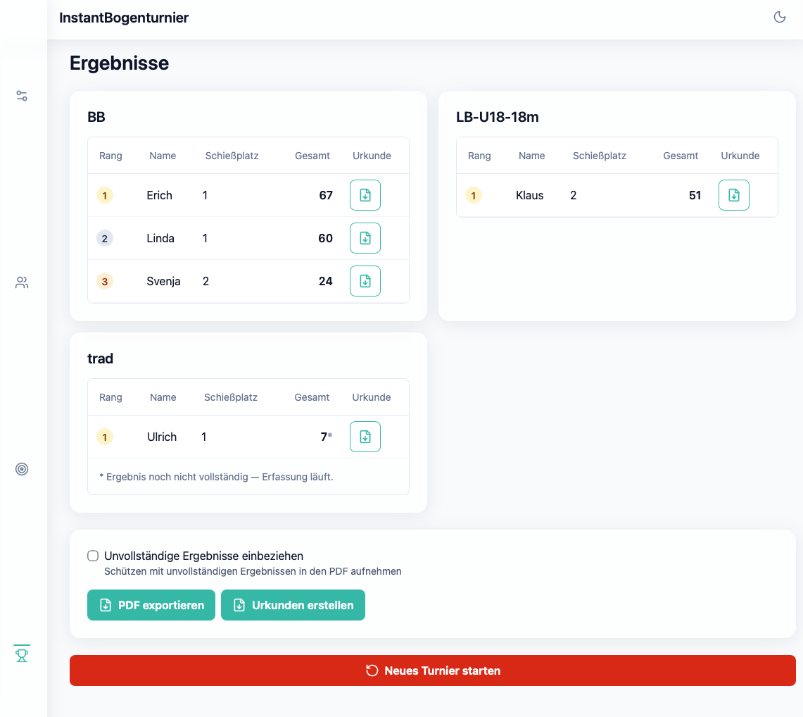

# Bogen-Trainingsturnier Verwaltung 🎯

A client-side web app (installable PWA) that lets an archery club trainer run informal training tournaments as judge (Kampfrichter) — from pre-tournament setup, through shooter registration and live score entry, to ranked results. Fully usable **offline**, on a single device, at the shooting range.

> Score entry and results ranking must work correctly and offline, on one device, during a live tournament — everything else is secondary.

## Features

- **Setup** — define classes (age group / bow type / distance), shooting lines, and rounds/passes (WA 10-ring or DFBV 5-ring presets, or fully custom), with 4–8 savable/loadable tournament presets (export/import included)
- **Registration** — register shooters with name, class, and optional shooting-line assignment; app detects AB vs. AB/CD mode automatically
- **Score Entry** — per-arrow tap-button or keyboard score entry with instant autosave (no explicit save step, no data loss), an audio+screen-flash confirmation on every tap, unconditional "<"/">" buttons for quickly stepping back and forth through ends (wrapping at round boundaries), a sortable table, and an explicit "Abschließen" (finalize/lock) step once every arrow is entered
- **Results** — live-updating, correctly-ranked results per class (standard "1-2-2-4" tie handling), adaptive layout: dropdown class selector on phone, responsive multi-column grid on tablet/desktop
- **PDF export** — ranked results list, per-shooter certificates (bulk ZIP or single), and a blank A5 scoresheet for paper fallback, all with a configurable title and header logos
- **Continue on another device** — export the whole live tournament (classes, shooters, scores, settings) to a file from the Ergebnisse tab and re-import it on another device (e.g. via iCloud Drive) to keep going
- **Reset** — explicit "Neues Turnier starten" action clears shooters/scores while keeping classes, lines, rounds, and presets configured
- **Offline-first PWA** — installable to your device's home screen, fully functional with zero network connectivity, automatic light/dark theme with manual override
- **Data safety** — once a tournament is finalized, destructive edits (deleting shooters, changing rounds/passes) are blocked until you reset

## Screenshots

**Setup**


**Archers**


**Scores**


**Results**


## Tech Stack

- [Svelte 5](https://svelte.dev/) (runes) + [Vite 8](https://vite.dev/) + [TypeScript](https://www.typescriptlang.org/)
- [Tailwind CSS 4](https://tailwindcss.com/)
- [Dexie.js](https://dexie.org/) (IndexedDB) for local, offline-first data storage
- [vite-plugin-pwa](https://vite-pwa-org.netlify.app/) for the installable, offline service worker
- [Vitest](https://vitest.dev/) + [@testing-library/svelte](https://testing-library.com/docs/svelte-testing-library/intro/) for unit/component tests, [Playwright](https://playwright.dev/) for e2e tests

## Branding / Club Color

The app's highlight color (buttons, links, active states) is defined once, as a
Tailwind `teal` palette override in `src/custom.css`. Every `teal-*` utility class used
throughout the app resolves to those variables, so re-skinning the app for a different
club is a single edit: generate a 300/400/500/600/700/900 shade scale for your club
color (e.g. via [uicolors.app](https://uicolors.app/create)) and paste the six hex
values into that file, keeping the variable names unchanged. Also update `themeColor`
in `src/lib/config/app.config.ts` (usually the 500 shade) to match — it drives the
separate PWA install icon/splash-screen tint, which isn't styled via Tailwind classes.

`src/custom.css` is gitignored, not checked in — `npm install` creates it automatically
from the `src/custom.css.example` template on first run (via a `postinstall` script) if
it doesn't exist yet, and never overwrites an existing one. This means a club's color
customization lives only on that club's machine/fork and never shows up as a diff
against the upstream project, so pulling updates never conflicts with a rebrand. If you
want to version your club's color choice, commit your edited `custom.css.example`
instead (or fork).

## Installation

**Requirements:** Node.js `^20.19.0` or `>=22.12.0`

```bash
git clone https://github.com/JoeSey/InstantBogenturnier.git
cd InstantBogenturnier
npm install
```

## Development

```bash
npm run dev       # start the dev server (hot reload)
npm run build     # production build → dist/
npm run preview   # preview the production build locally
```

## Testing

```bash
npm run check     # type-check (svelte-check + tsc)
npm run test      # unit/component tests (Vitest)
npm run test:e2e  # end-to-end tests (Playwright)
npm run test:all  # unit + e2e
```

## Deployment

This is a static, client-only app — deploy the **built output**, not the source tree.

```bash
npm run build   # writes the deployable site to dist/
```

Copy the contents of `dist/` to your web server's document root (or a sub-path — see
below). `npm run preview` serves `dist/` locally if you want to sanity-check a build
before deploying it.

**Common mistake:** if the browser fails to load `main.ts` with an error like
`Expected a JavaScript-or-Wasm module script but the server responded with a MIME
type of "text/vnd.trolltech.linguist"`, the server is serving the *repository source*
(`index.html` at the project root references `/src/main.ts` directly, which only
Vite's dev server knows how to transpile) instead of `dist/`. Many Linux systems'
global MIME database maps the `.ts` extension to Qt Linguist translation files, which
is where that specific error text comes from. Point your web server at `dist/`, not
the repo root.

### Deploying to a sub-path

If the app won't be served from your domain's root (e.g.
`https://example.com/bogenturnier/` instead of `https://example.com/`), set
`VITE_BASE_PATH` to that path when building — with leading **and** trailing slash:

```bash
VITE_BASE_PATH=/bogenturnier/ npm run build
```

This must match the exact URL path the browser will load the app from — not where you
happened to clone/build the repo on disk. E.g. if you cloned the repo into a `bt/`
folder on the server and your web server serves that folder's `dist/` subdirectory
directly at `https://example.com/bt/dist/`, then `VITE_BASE_PATH=/bt/dist/` is correct.
If instead you configure the server to serve `dist/`'s *contents* at
`https://example.com/bt/`, use `VITE_BASE_PATH=/bt/` and rebuild.

This value drives both Vite's asset base path and the PWA manifest's
`scope`/`start_url` — both must match the actual hosting path or the installed PWA's
service-worker scope will be wrong and offline routing will silently break. Never
commit a deployment-specific value — set it as a build-time env var each time.

## Project Status

Current release: **v1.5**. See [`.planning/MILESTONES.md`](.planning/MILESTONES.md) for the full milestone history and [`specs.md`](specs.md) for the original feature spec; [`.planning/`](.planning/) has detailed requirements, decisions, and per-phase implementation records.

## License

[MIT](LICENSE)
